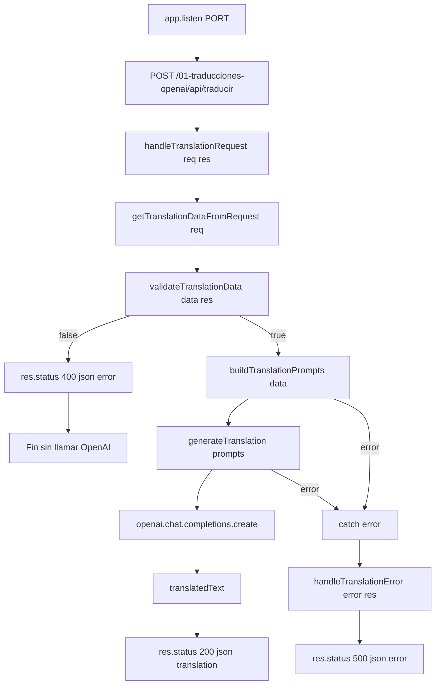

# Flujo de llamadas de la app

Este documento describe la secuencia real de ejecucion en [app.js](app.js).

## 1) Arranque de la aplicacion

1. Se cargan imports (Express, dotenv, OpenAI, path, url).
2. Se ejecuta dotenv.config().
3. Se calculan rutas del proyecto:
   - currentFilePath
   - currentDirPath
   - publicDirPath
4. Se crea app con express().
5. Se define PORT y base.
6. Se crea cliente openai.
7. Se registran middlewares:
   - app.use(base, express.static(publicDirPath))
   - app.use(express.json())
   - app.use(express.urlencoded({ extended: true }))
8. Se registra endpoint:
   - app.post(`${base}/api/traducir`, handleTranslationRequest)
9. Se inicia servidor:
   - app.listen(PORT, ...)

## 2) Flujo principal de traduccion (request POST)

Entrada HTTP:
- Metodo: POST
- Ruta: /01-traducciones-openai/api/traducir
- Body esperado:
  - text
  - targetLang

Cadena de llamadas:

1. app.post(..., handleTranslationRequest)
2. handleTranslationRequest(req, res)
3. getTranslationDataFromRequest(req)
4. validateTranslationData(data, res)
5. Si valida:
   - buildTranslationPrompts(data)
   - generateTranslation(prompts)
   - openai.chat.completions.create(...)
6. Respuesta exitosa:
   - res.status(200).json({ translation })

## 3) Ramas de control

### Rama A: validacion falla

1. handleTranslationRequest llama validateTranslationData.
2. Si faltan text o targetLang:
   - validateTranslationData responde:
     - res.status(400).json({ error: 'Faltan parametros: text o targetLang' })
3. handleTranslationRequest hace return.
4. No se llama a OpenAI.

### Rama B: error durante traduccion

1. handleTranslationRequest entra en try.
2. Si falla buildTranslationPrompts o generateTranslation (incluyendo OpenAI):
   - catch(error)
   - handleTranslationError(error, res)
3. handleTranslationError responde:
   - res.status(500).json({ error: 'Error al traducir el texto.' })

## 4) Mapa rapido tipo grafo

app.listen(PORT, ...)  (inicia servidor)

POST /01-traducciones-openai/api/traducir
-> handleTranslationRequest(req, res)
   -> getTranslationDataFromRequest(req)
   -> validateTranslationData(data, res)
      -> [false] 400 y return
      -> [true] buildTranslationPrompts(data)
               -> generateTranslation(prompts)
                  -> openai.chat.completions.create(...)
               -> res.status(200).json({ translation })
   -> catch(error)
      -> handleTranslationError(error, res)
         -> res.status(500).json({ error })

## 5) Notas utiles

- La ruta usa prefijo base: /01-traducciones-openai.
- El endpoint es POST, no GET.
- El consumo de OpenAI solo ocurre en la rama valida (cuando pasa validateTranslationData y llega a generateTranslation).

## 6) Diagrama Mermaid



   ## 7) Diagrama Mermaid por bloques

   ```mermaid
   flowchart LR
      subgraph Inicio
         A[app.listen PORT]
         B[POST /01-traducciones-openai/api/traducir]
         C[handleTranslationRequest req res]
      end

      subgraph Preparacion
         D[getTranslationDataFromRequest req]
         E[validateTranslationData data res]
      end

      subgraph OpenAI
         H[buildTranslationPrompts data]
         I[generateTranslation prompts]
         J[openai.chat.completions.create]
         K[translatedText]
      end

      subgraph Respuestas
         F[res.status 400 json error]
         G[Fin sin llamar OpenAI]
         L[res.status 200 json translation]
         M[catch error]
         N[handleTranslationError error res]
         O[res.status 500 json error]
      end

      A --> B --> C --> D --> E
      E -->|false| F --> G
      E -->|true| H --> I --> J --> K --> L
      H -->|error| M
      I -->|error| M
      J -->|error| M
      M --> N --> O
   ```
